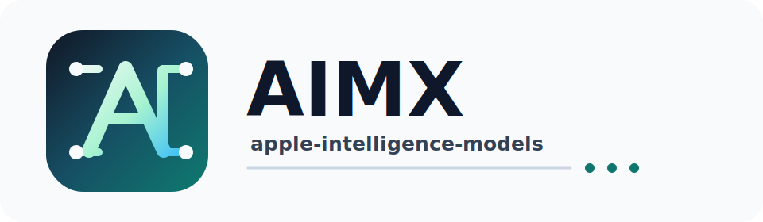

# AIMX (`apple-intelligence-models`)

<p align="center">
  
</p>

[](https://crates.io/crates/apple-intelligence-models)
[](https://docs.rs/apple-intelligence-models)
[](LICENSE)
[](https://github.com/hghalebi/AIMX/actions/workflows/ci.yml)
[](https://github.com/hghalebi/AIMX/actions/workflows/docs.yml)

AIMX is a safe Rust library for Apple's [FoundationModels] on-device language
model framework, also known as Apple Intelligence.

The package is published as `apple-intelligence-models` and imported as `aimx`.
The model runs locally on supported Apple hardware, so a basic application does
not need an API key, a network request, or a hosted inference provider.

The documentation is written in the style of official Rust crate docs: start
with the smallest correct example, name every boundary, and document the errors
that users can recover from. The tutorial then teaches the same API one concept
at a time.

## Status

This crate is a thin safe wrapper around Apple's FoundationModels framework. It
is designed as a library crate, not an application. The public API uses typed
boundaries for prompts, instructions, generation options, response text,
structured output schemas, and tool-call results.

The crate also compiles on unsupported hosts. If the Swift bridge cannot be
built, or if Apple Intelligence is not available at runtime, model APIs return
`Error::Unavailable` instead of panicking or failing to link.

## Requirements

| Requirement | Value |
|---|---|
| Rust | 1.85 or newer |
| macOS for live model use | 26 (Tahoe) or newer |
| Hardware for live model use | Apple Silicon (M1 or newer) |
| System setting | Apple Intelligence enabled |
| Build tool for live bridge | Xcode with the macOS 26 SDK |

## How To Read The Docs

If you are new to AIMX, read the docs in this order:

1. Run the [Quick Start](#quick-start) to see the smallest complete program.
2. Read [The Mental Model](#the-mental-model) to understand the core types.
3. Use [Builder-Style Sessions](#builder-style-sessions) for real applications.
4. Follow [TUTORIAL.md](TUTORIAL.md) when you want a guided, course-style path.
5. Browse the generated rustdoc site at
   [hghalebi.github.io/AIMX](https://hghalebi.github.io/AIMX/).
6. Use the files in [`references/`](references) for implementation details.

## Local CI With `act`

You can run the GitHub Actions workflows locally with [`act`](https://github.com/nektos/act).

The repo includes a checked-in [`.actrc`](.actrc) so `act` uses a Linux image
that matches the workflows.

Useful commands:

```sh
act workflow_dispatch -W .github/workflows/act.yml -j quality
act workflow_dispatch -W .github/workflows/act.yml -j msrv
```

Notes:

- The local workflow keeps only the Linux jobs that work well in Docker.
- The production workflows stay unchanged for GitHub Actions.
- If you want to exercise docs generation locally too, use the `quality` job in `.github/workflows/act.yml`.

## The Mental Model

AIMX has three layers:

| Layer | Rust type | What it teaches |
|---|---|---|
| Availability | `availability`, `AppleIntelligenceModels::availability` | Check whether the local model can run before doing work. |
| Session | `LanguageModelSession` | Keep instructions, options, tools, and conversation state together. |
| Boundaries | `Prompt`, `SystemInstructions`, `Temperature`, `MaxTokens`, `GenerationSchema` | Convert raw input into typed values before it crosses FFI or model boundaries. |

The important idea is simple: raw input is allowed at the edge of your program,
but AIMX turns it into typed Rust values before it reaches Apple
FoundationModels. That keeps failures recoverable and makes examples behave the
same way on supported and unsupported hosts.

## Install

Add the crate to `Cargo.toml`:

```toml
[dependencies]
aimx = { package = "apple-intelligence-models", version = "0.2.1" }
```

The crate is runtime-agnostic. Use the async executor already present in your
application. The examples below use Tokio and `futures-util` for convenience:

```toml
[dependencies]
tokio = { version = "1", features = ["macros", "rt-multi-thread"] }
futures-util = "0.3"
aimx = { package = "apple-intelligence-models", version = "0.2.1" }
```

## Quick Start

```rust
use aimx::{is_available, respond};

#[tokio::main]
async fn main() -> Result<(), Box<dyn std::error::Error>> {
    if !is_available() {
        eprintln!("Apple Intelligence is not available on this device");
        return Ok(());
    }

    let answer = respond("What is the capital of France?").await?;
    println!("{answer}");

    Ok(())
}
```

Run the checked-in executor-neutral example:

```sh
cargo run --example quickstart
```

Explore deterministic agent use-case examples:

```sh
cargo run --example agent_use_cases
cargo test --example agent_use_cases
```

For a full walkthrough, see [TUTORIAL.md](TUTORIAL.md).

## Builder-Style Sessions

Use `AppleIntelligenceModels::default().session()` when you want AIMX-owned
session state: instructions, default generation options, tools, or multi-turn
context.
`agent()` and `preamble()` are kept as Rig-style aliases.

```rust
use aimx::{MaxTokens, AppleIntelligenceModels, Temperature};

async fn run() -> Result<(), aimx::Error> {
    let session = AppleIntelligenceModels::default()
        .session()
        .instructions("You are a concise Rust expert.")
        .temperature(Temperature::new(0.2)?)
        .max_tokens(MaxTokens::new(256)?)
        .build()?;

    let first = session.respond_to("What is ownership?").await?;
    let second = session.respond_to("Give me a one-line example.").await?;
    println!("{first}\n{second}");

    Ok(())
}
```

## Generation Options

Generation settings are typed after input crosses your application boundary.
Use `try_temperature` and `try_max_tokens` only where raw UI, CLI, or JSON
values first enter your code.

```rust
use aimx::{GenerationOptions, MaxTokens, Temperature};

fn options() -> Result<GenerationOptions, aimx::Error> {
    Ok(GenerationOptions::new()
        .temperature(Temperature::new(0.2)?)
        .max_tokens(MaxTokens::new(256)?))
}
```

## Streaming

```rust
use futures_util::StreamExt as _;
use aimx::LanguageModelSession;

async fn run() -> Result<(), aimx::Error> {
    let session = LanguageModelSession::new()?;
    let mut stream = session.stream_response("Tell me a short story.")?;

    while let Some(chunk) = stream.next().await {
        print!("{}", chunk?);
    }
    println!();

    Ok(())
}
```

## Structured Generation

Describe the expected JSON object with a `GenerationSchema`, then deserialize the response
into your own type.

```rust
use aimx::{GenerationSchema, GenerationSchemaProperty, GenerationSchemaPropertyType, LanguageModelSession};
use serde::Deserialize;

#[derive(Deserialize)]
struct Capital {
    city: String,
    country: String,
    population: i64,
}

async fn run() -> Result<(), aimx::Error> {
    let session = LanguageModelSession::new()?;
    let schema = GenerationSchema::new("Capital")
        .description("A country capital")
        .property(GenerationSchemaProperty::new("city", GenerationSchemaPropertyType::String))
        .property(GenerationSchemaProperty::new("country", GenerationSchemaPropertyType::String))
        .property(GenerationSchemaProperty::new("population", GenerationSchemaPropertyType::Integer));

    let capital: Capital = session
        .respond_generating("What is the capital of France?", &schema)
        .await?;
    println!("{} is in {}", capital.city, capital.country);

    Ok(())
}
```

## Tool Calling

Tools are Rust handlers registered on a session. Tool outputs and failures use
typed boundaries instead of raw strings.

```rust
use aimx::{
    AppleIntelligenceModels, Error, GenerationSchema, GenerationSchemaProperty,
    GenerationSchemaPropertyType, ToolCallError, ToolDefinition, ToolOutput,
};
use serde_json::Value;

async fn run() -> Result<(), Error> {
    let weather = ToolDefinition::builder(
        "get_weather",
        "Return current weather for a city",
        GenerationSchema::new("WeatherArgs")
            .property(GenerationSchemaProperty::new("city", GenerationSchemaPropertyType::String)),
    )
    .handler(|args: Value| {
        let city = args
            .get("city")
            .and_then(Value::as_str)
            .ok_or_else(|| ToolCallError::new("missing string field: city"))?;

        Ok(ToolOutput::from(format!("{city}: 22 C, sunny")))
    });

    let session = AppleIntelligenceModels::default()
        .session()
        .instructions("You are a weather assistant.")
        .tool(weather)
        .build()?;

    let response = session.respond_to("What is the weather in Tokyo?").await?;
    println!("{response}");

    Ok(())
}
```

## MLX-Style Aliases

The same session exposes MLX-flavored names when that reads better in model
inference code:

```rust
use aimx::AppleIntelligenceModels;

async fn run() -> Result<(), aimx::Error> {
    let session = AppleIntelligenceModels::default().session().build()?;
    let text = session.generate("Summarize Rust ownership.").await?;
    let stream = session.stream_generate("Write three bullet points.")?;
    let _ = (text, stream);
    Ok(())
}
```

## Availability Checking

```rust
use aimx::{availability, AvailabilityError};

match availability() {
    Ok(()) => println!("Apple Intelligence is ready"),
    Err(AvailabilityError::DeviceNotEligible) => {
        eprintln!("Requires Apple Silicon M1 or newer")
    }
    Err(AvailabilityError::NotEnabled) => {
        eprintln!("Enable Apple Intelligence in System Settings")
    }
    Err(AvailabilityError::ModelNotReady) => {
        eprintln!("The on-device model is still downloading")
    }
    Err(AvailabilityError::Unknown) => eprintln!("Unknown availability state"),
}
```

## Development

Run the standard gates:

```sh
cargo fmt
cargo test
cargo test --examples
cargo clippy --all-targets --all-features -- -D warnings
RUSTDOCFLAGS="-D warnings" cargo doc --no-deps
cargo package
```

Run the deterministic Rust-layer performance benchmarks:

```sh
cargo bench --bench core -- --sample-size 10
```

Live model tests are ignored by default because they require Apple Intelligence:

```sh
cargo test -- --include-ignored
```

## How It Works

The crate ships `bridge.swift`, which `build.rs` compiles into a static library
with `xcrun swiftc` when the target and SDK support it. Swift exports a small C
ABI surface with `@_cdecl`; Rust keeps those calls behind a private FFI layer
and exposes safe APIs from `src/lib.rs`.

If bridge compilation fails, the build continues without the bridge cfg and
public model APIs return `Error::Unavailable`.

See [references/async-architecture.md](references/async-architecture.md) for the
callback, channel, cancellation, and tool-handler panic boundaries.
See [references/performance.md](references/performance.md) for the benchmark
scope and commands.
See [references/documentation-style.md](references/documentation-style.md) for
the repository documentation style guide.

## Release Automation

GitHub Actions owns the normal release path:

1. Pull requests run formatting, tests, examples, clippy, rustdoc, benchmark
   compilation, package verification, and primitive-boundary checks.
2. Pushes to `main` build and deploy the rustdoc site to GitHub Pages.
3. Version tags such as `v0.2.1` publish the matching Cargo version to
   crates.io after the same release checks pass.

The crates.io release workflow uses trusted publishing. Configure the crate on
crates.io to trust repository `hghalebi/AIMX`, workflow `release.yml`, and
environment `crates-io`.

## Contributing

See [CONTRIBUTING.md](CONTRIBUTING.md). Changes should keep the public API
documented, typed at FFI boundaries, safe on unsupported hosts, and consistent
with the repository documentation style.

## License

Licensed under the [Mozilla Public License 2.0](LICENSE).

[FoundationModels]: https://developer.apple.com/documentation/foundationmodels
