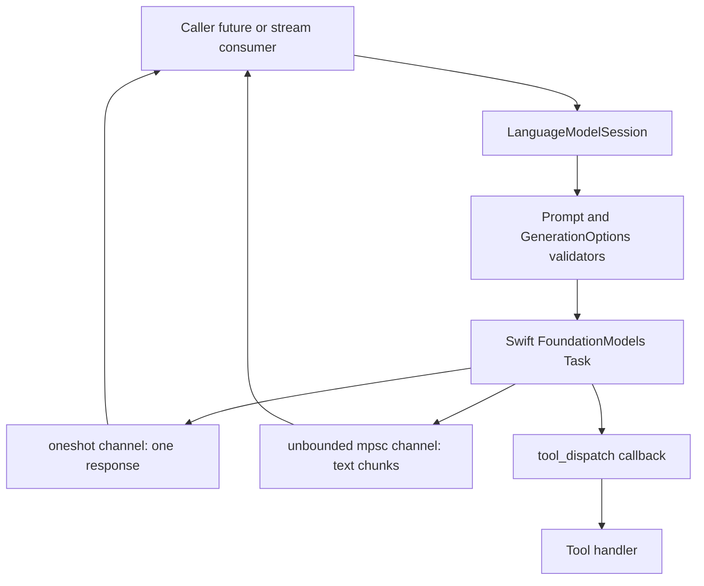

# Async Architecture

AIMX is runtime-agnostic. It exposes `async` functions and
`futures_core::Stream`, but it does not spawn Tokio tasks or require a Tokio
runtime. Swift owns the FoundationModels task execution; Rust owns typed
boundary validation and callback-to-channel adaptation.

## Task And Channel Topology



## Cancellation Safety

- A single-shot request allocates `ResponseContext`, which owns the
  `oneshot::Sender` and a cloned `Arc<SessionHandle>`.
- A streaming request allocates `StreamContext`, which owns the stream sender
  and a cloned `Arc<SessionHandle>`.
- Dropping the caller future or `ResponseStream` closes the receiving side, but
  the Swift session handle remains alive until Swift invokes the completion
  callback and Rust drops the context box.
- Callback sends intentionally ignore closed-channel errors because receiver
  closure is the normal cancellation signal.

## Panic Handling

Tool handlers are user code. AIMX calls them through `catch_unwind` and converts
panics into `ToolCallError`, preventing unwinding through public tool calls or
the Swift callback boundary.

## Backpressure Strategy

Single-shot responses use `oneshot` because exactly one completion is expected.

Streaming uses an unbounded `mpsc` channel because C callbacks cannot `await`
capacity without blocking Swift. This favors callback safety over memory
backpressure. Consumers can cancel by dropping `ResponseStream`; subsequent
callback sends fail cheaply and are ignored.

## Async Refactor Notes

The library runtime path does not use blocking `std::fs`, `std::net`,
`std::thread::sleep`, or `std::sync::Mutex`. `build.rs` invokes `xcrun` through
`std::process::Command`, but that happens at compile time rather than inside a
user async runtime. Tests and examples may use `futures_executor::block_on` to
drive examples without choosing a production runtime for callers.

Hot callback paths avoid avoidable JSON string allocations:

Before:

```rust
let args_json = CStr::from_ptr(args_ptr).to_string_lossy().into_owned();
let args = serde_json::from_str(&args_json)?;
```

After:

```rust
let args = CStr::from_ptr(args_ptr);
let args = serde_json::from_slice(args.to_bytes())?;
```

Session and schema metadata also serialize with `serde_json::to_vec` before
`CString::new`, avoiding an intermediate UTF-8 `String` allocation.

## Ports And Adapters

Ports:

- `LanguageModel`: async typed text generation with per-request options.
- `GenerateText`: convenience port over `LanguageModel`.
- `CompletionModel`: Rig-compatible alias port.
- `Tool`: typed tool metadata plus fallible JSON argument execution.

Adapters:

- `AppleIntelligenceModels`: public model handle that builds sessions.
- `LanguageModelSession`: stateful FoundationModels transcript adapter.
- `respond_callback`: adapts Swift single-shot completion into `oneshot`.
- `stream_token_callback` and `stream_done_callback`: adapt Swift streaming into
  `ResponseStream`.
- `tool_dispatch`: adapts Swift tool calls into `Tool` execution and typed tool
  results.
